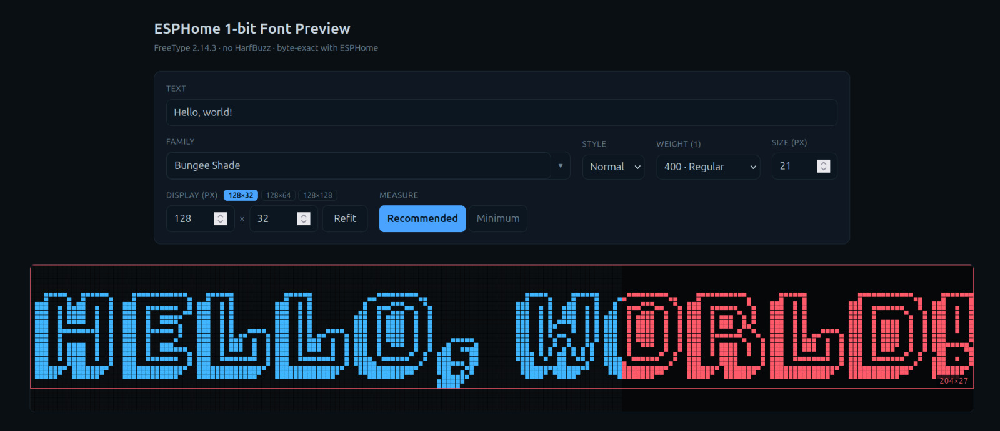

# ESPHome 1-bit Font Preview

Preview how any [Google Font](https://fonts.google.com/) renders as **1-bit / monochrome
glyphs on an ESPHome display** — before you flash anything.

It runs FreeType in WebAssembly and mirrors ESPHome's own glyph path
(`FT_LOAD_RENDER | FT_LOAD_TARGET_MONO`, point→pixel metrics, FreeType 2.14.3, no
HarfBuzz), so the pixels you see in the browser match the pixels the device draws.

**▶ Live demo: https://shyndman.github.io/esphome-1bit-font-preview/**



## Features

- Browse all ~1,580 Google Fonts families with live style/weight selection.
- Pixel size + one-click **Refit** to the current display dimensions.
- **Measurement mode** — *Recommended* (ink + metrics) vs *Minimum* (tight ink box).
- Glyph-bounds overlay on the preview; overflow past the display frame turns red.
- Shareable URL state — the whole configuration round-trips through the address bar.
- `Shift`+`Arrow` steps numeric inputs by 10.

## Local development

```sh
cd app
npm install
npm run dev
```

The app is fully static and runs offline: the font catalog
(`app/public/fonts.json`) and the FreeType WASM (`app/public/wasm/`) are committed.
Font binaries (TTF) are fetched on demand from Google's CDN.

## Refreshing the font catalog

The catalog is derived from [`jonathantneal/google-fonts-complete`][gfc], vendored as
a pinned git submodule, then shrunk to TTF URLs only:

```sh
git submodule update --init lib/google-fonts-complete
npm --prefix app run fonts   # -> regenerates app/public/fonts.json
```

## Rebuilding the WASM renderer

The renderer source is [`wasm/ftrender.c`](wasm/ftrender.c), compiled against
FreeType via the [`discere-os/freetype.wasm`][ftw] toolchain (pinned submodule).
The compiled artifact is committed under `app/public/wasm/`, so a rebuild is only
needed when the C source changes.

## Credits

- [`jonathantneal/google-fonts-complete`][gfc] — Google Fonts catalog data.
- [`discere-os/freetype.wasm`][ftw] — FreeType WebAssembly toolchain.
- [ESPHome](https://esphome.io/) — the rendering behaviour this mirrors.

[gfc]: https://github.com/jonathantneal/google-fonts-complete
[ftw]: https://github.com/discere-os/freetype.wasm
